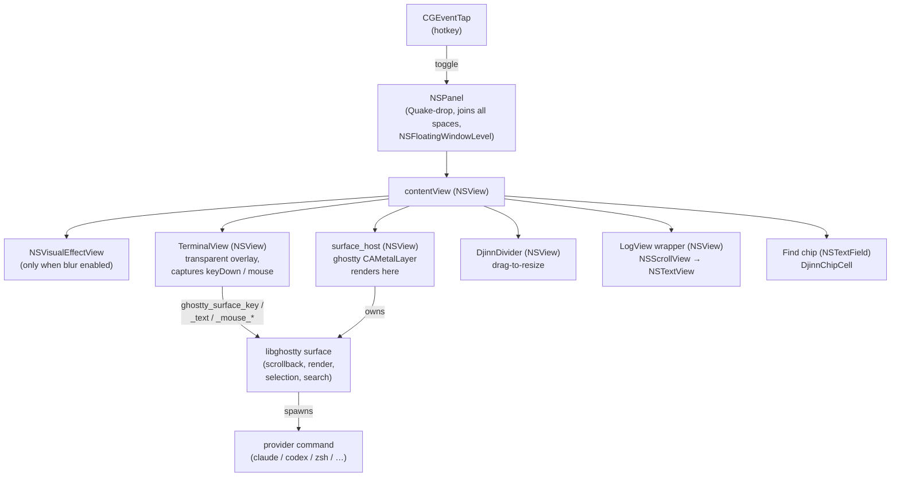
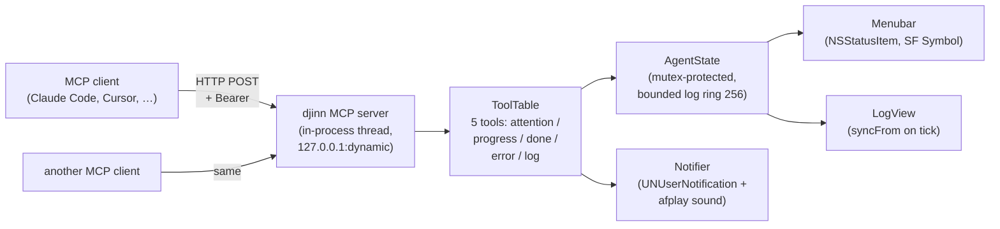
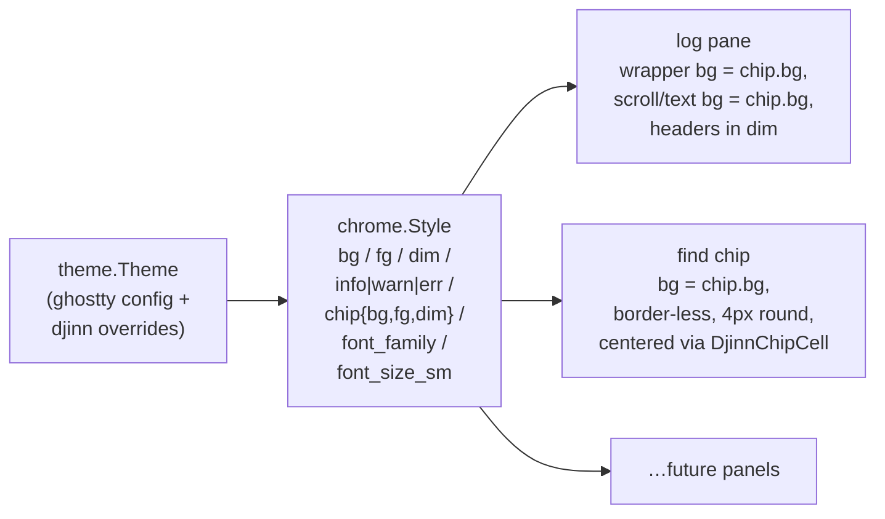

# djinn

Quake-drop terminal for macOS, with an MCP-driven agent status surface.

Two products in one binary:

- A native macOS Quake-drop popup terminal (NSPanel + libghostty + CoreText, with selection, blur, live resize, and a side log).
- An HTTP MCP server that lets AI coding agents push structured status to the menubar — so you know the agent's state without keeping the terminal focused.

## Status

djinn is a libghostty-surface host. ghostty owns the visible
terminal area end-to-end (PTY, render, scrollback, selection,
hyperlink hover, search, IME). djinn keeps panel chrome, MCP
server, agent state surface, hotkey, menubar, log pane, drag-drop,
find-overlay UI, and an action keymap.

Working:

- Hotkey-toggled NSPanel (Quake-drop, follows you across spaces, overlays fullscreen).
- libghostty surface bound to a layer-backed NSView; ghostty's CAMetalLayer renders directly.
- Live window resize that reflows the surface + grid.
- NSVisualEffectView blur when ghostty config sets `background-blur-radius`.
- Mouse selection + Cmd+C copy + Cmd+V paste (surface-owned).
- Scrollback (mouse wheel + Cmd+Up/Down).
- Find on page (Cmd+F) — host-owned overlay chip + ghostty's surface search API.
- IME (NSTextInputClient) — preedit + candidate window anchored at the cursor cell.
- Drag-drop file URLs + image data (PNG/TIFF saved to /tmp, paths pasted bracketed).
- Hyperlink hover (OSC 8) with Cmd-click open.
- Menubar SF Symbol icon with a dropdown menu (state, show/hide, copy MCP config, quit).
- HTTP MCP server with bearer-token auth.
- Five-tool MCP surface (attention / progress / done / error / log).
- Side log panel — feed-style entries, group-by-client, drag-to-resize.
- Ghostty config inheritance (font, palette, padding, opacity, blur, theme files with `light:X,dark:Y` switching by system appearance) + live reload.
- User-configurable keymap action table (`keybind = action=trigger`).
- Bell (audible / visual).
- SMAppService login-item registration when launched from the bundle.
- Unified chrome design language (`src/chrome.zig`): log pane + find chip share Style-derived colors + typography.

Known gaps: per-call log expansion (collapsed args + result), animated row insertion, sleep/wake recovery. See `TODO.md`.

## Build

### Prerequisites (one-time)

- **Zig 0.15.2+.** Either install via your package manager (`brew install zig`, mise, asdf, …) or use the included nix flake (see below).
- **Xcode + the optional Metal Toolchain.** djinn links the full libghostty, whose renderer compiles `.metal` shaders:

  ```sh
  sudo xcodebuild -downloadComponent MetalToolchain
  ```

  Several GB; only needs to happen once per Xcode install.

### Build

```sh
./scripts/build.sh                              # debug, zig-out/bin/djinn
./scripts/build.sh test                         # unit tests
./scripts/build.sh -Doptimize=ReleaseFast       # release exe
./scripts/build.sh install-app                  # signed bundle → ~/Applications
```

`scripts/build.sh` wraps `zig build` and handles two integration steps:

1. Applies `patches/ghostty-001-darwin-install.patch` to the cached ghostty source via `scripts/apply-ghostty-patch.sh`. The patch drops an upstream darwin install guard + registers the shared lib in the artifact registry so `dep.artifact("ghostty")` resolves on macOS. Idempotent — re-runs are no-ops.
2. Unsets `DEVELOPER_DIR` + `SDKROOT` and prepends `/usr/bin` to `PATH` so `xcrun` finds the system Metal Toolchain (nix dev shells default these env vars to a stripped Apple SDK that ships no Metal).

If you have `just` installed, the `justfile` exposes the same recipes (`just build`, `just test`, `just install-app`, `just release`, …). Each recipe wraps `nix develop --command bash -c ...` so it works regardless of whether you're inside the dev shell — see "Without a system zig" below.

Debug builds run libghostty's verifyIntegrity sweep and look ~3× slower than they actually are; use ReleaseFast for any performance measurement.

### Without a system zig — use the nix flake

If you don't have zig 0.15.2 on PATH, the flake supplies it:

```sh
nix develop                      # drop into a shell with the right zig
./scripts/build.sh install-app   # then build as normal
```

Or invoke the same step in one shot:

```sh
nix develop --command ./scripts/build.sh install-app
```

The flake also exposes `apps.*` runners that wrap `zig build` for nix-only users (no clone-and-zig dance):

```sh
nix run .                # build + launch the dev exe
nix run .#bundle         # build the signed Djinn.app
nix run .#install        # build + sign + rsync to ~/Applications
nix run .#test           # run the unit suite
nix flake check          # tests in the sandbox
```

**These runners build on the HOST against your working tree**, not inside `/nix/store`. djinn doesn't ship a pure `packages.default`: ghostty's `.metal` shader compile goes through `xcrun → metal`, and Apple ships the Metal Toolchain through cryptexd at `/var/run/com.apple.security.cryptexd/...`, which the nix builder can't reach even with `__noChroot = true`.

### Why a wrapper script

`dep.artifact("ghostty")` on darwin is blocked by an unintentional install guard in upstream ghostty (their own comment: "we shouldn't have this guard but we don't currently build on macOS this way ironically so we need to fix that"). djinn vendor-patches the guard locally; see `patches/ghostty-001-darwin-install.patch` for the full motivation.

## Install

### Quick install (pre-built bundle)

```sh
curl -fsSL https://github.com/pders01/djinn/releases/download/pre-release/install.sh | bash
```

Downloads the latest `main`-tip bundle, drops it into `~/Applications`, opens it. macOS prompts for Accessibility permission on first launch (needed for the global hotkey).

The `pre-release` tag is rolled forward on every push to `main`, so the installer always pulls the freshest build. For a pinned alpha/beta build, use a stable tag from [Releases](https://github.com/pders01/djinn/releases) and replace `pre-release` in the URL.

The downloaded bundle is ad-hoc signed (no Apple Developer ID — see "Stable signing identity" below). macOS Gatekeeper may show a "downloaded from the internet" prompt on first launch despite the installer stripping the quarantine xattr; click "Open" to proceed.

### Build from source

For a real install — Spotlight launchable, login-item capable, surviving relog — build the signed `.app` bundle and copy it to `~/Applications`:

```sh
./scripts/build.sh install-app
open ~/Applications/Djinn.app
```

(or `nix run .#install` if you don't have zig locally — both run the same `bundle-sign` → ad-hoc codesign → rsync chain.)

The bundle lands at `~/Applications/Djinn.app` (no sudo). macOS treats `~/Applications` as a first-class Application directory on macOS 12+, so SMAppService login-items work from there.

The intermediate steps if you want to inspect or move artefacts manually:

```sh
zig build bundle        # zig-out/Djinn.app, unsigned
zig build bundle-sign   # zig-out/Djinn.app + ad-hoc signature
```

### First launch

macOS asks for **Accessibility** permission for the global hotkey (CGEventTap). Without it the app exits. Grant via System Settings → Privacy & Security → Accessibility, then re-launch.

### Login-item

Once the bundle is in `~/Applications`:

```sh
~/Applications/Djinn.app/Contents/MacOS/djinn --login-item-enable
~/Applications/Djinn.app/Contents/MacOS/djinn --login-item-status
```

The CLI flags wrap `SMAppService.mainAppService` and only work from a code-signed bundle home — running the raw `./zig-out/bin/djinn` will return `error.OperationFailed`. Disable with `--login-item-disable` or via `system.open_at_login = false` in the config.

### Stable signing identity (one-shot)

By default every `install-app` re-signs ad-hoc, which produces a fresh cdhash and burns TCC's Accessibility / Input Monitoring grants — the hotkey silently stops working until you reset + re-grant. To keep grants across rebuilds without paying for a Developer ID:

```sh
just dev-cert
```

Generates a self-signed code-signing certificate (`DjinnLocalDev`) in your login keychain, marks it trusted-for-code-signing locally, and wires it into the bundle codesign step. The bundle's designated requirement (`identifier "com.pders01.djinn" and certificate leaf = H"…"`) then stays constant across rebuilds, so TCC matches subsequent builds as the same app and preserves grants.

Idempotent — re-running detects the existing identity and skips. The cert is local-only; it doesn't pass Gatekeeper notarization and isn't a substitute for a paid Developer ID for distribution. Solo iteration only.

### If it's stuck

Symptoms: hotkey does nothing, panel never appears, or the running djinn keeps the old binary loaded.

If you've run `just dev-cert`, the cdhash-driven grant churn shouldn't happen. If it does:

```sh
killall djinn                                # drop the running instance
tccutil reset All com.pders01.djinn          # clear stale TCC grants
just deploy                                  # rebuild bundle + sign + install + open
```

If you haven't run `just dev-cert`, every `install-app` will keep burning grants. Run it once and avoid the dance.

Standalone steps for inspection between stages:

```sh
nix develop --command bash -c './scripts/build.sh install-app'   # rebuild only
open ~/Applications/Djinn.app                                    # re-launch
```

After the next launch following a TCC reset, macOS prompts for Accessibility — grant it, re-launch, the hotkey is live.

## Wiring an agent

djinn writes its MCP endpoint info on startup to:

```
~/.config/djinn/mcp.json
```

The file already has the correct shape for Claude Code's `.mcp.json` (HTTP transport with bearer token). Three ways to use it:

- Click the menubar icon → **Copy MCP config to clipboard** → paste into your project's `.mcp.json`.
- Symlink it into a project: `ln -sf ~/.config/djinn/mcp.json .mcp.json`.
- Paste manually:

```json
{
  "mcpServers": {
    "djinn": {
      "type": "http",
      "url": "http://127.0.0.1:PORT",
      "headers": { "Authorization": "Bearer TOKEN" }
    }
  }
}
```

The token is regenerated and the port re-bound on each launch — re-paste after each djinn start.

## Tool surface

| Tool                       | Purpose                                                      |
|----------------------------|--------------------------------------------------------------|
| `djinn_attention`          | "I need user input" — flashes the menubar to attention state |
| `djinn_progress`           | "Working on X (3/8)" — menubar text update                   |
| `djinn_done`               | Task complete; menubar returns to a quiescent icon           |
| `djinn_error`              | Task failed                                                  |
| `djinn_log`                | Append a structured event to djinn's side log panel          |
| `djinn_recent_logs`        | Read recent log entries (JSON array)                         |
| `djinn_recent_attentions`  | Read pinned attention + recent warn entries (JSON object)    |
| `djinn_active_profile`     | Read active profile name / label / cwd / spawn command       |

Tools update djinn's internal `AgentState`; the menubar polls at ~4Hz, the log panel at the same cadence.

## UI

| Action               | Binding                              |
|----------------------|--------------------------------------|
| Show / hide          | `ctrl+space` (configurable)          |
| Resize               | Drag any edge or corner              |
| Select text          | Click and drag                       |
| Copy selection       | `cmd+C`                              |
| Special keys         | Arrows, home/end/pgup/pgdn, escape, return, tab, backspace |
| Ctrl + letter        | Sent as C0 control byte (Ctrl+L = 0x0c, etc.)              |
| Alt + key            | ESC-prefixed (xterm convention used by readline / zsh)     |
| Switch profile       | `cmd+1` … `cmd+9` (jump by index)    |
| Cycle profile        | `cmd+shift+]` next, `cmd+shift+[` prev |
| Find on page         | `cmd+F` open, `cmd+G` next, `cmd+shift+G` prev |
| Toggle log pane      | `cmd+/`                              |
| Filter log entries   | `cmd+shift+L` — type, Esc clears, Return keeps |
| Keymap cheatsheet    | `cmd+shift+.` — any key dismisses (Cmd+? is reserved by macOS) |
| Duplicate profile    | `cmd+shift+N` — clones active profile, reloads via FSEvent |
| Cycle theme override | `cmd+shift+T` — system → light → dark → system |
| Quit                 | `cmd+Q` (from the menubar menu)      |

The menubar dropdown also exposes show/hide, copy MCP config, and quit.

### Picking a hotkey that won't fight macOS

CGEventTap doesn't beat the system-shortcut layer: combos already
claimed by macOS (Spotlight, Mission Control, IME switchers,
text-replacement, …) reach those services before djinn's tap fires.
There is no public API to query the current system-shortcut bindings,
so the practical workaround is to pick a combo macOS doesn't ship
with.

Conflict-free defaults that work on a stock install:

- `ctrl+grave` — backtick key, no system claim by default
- `alt+space` — Spotlight defaults to `cmd+space`, leaving alt+space free
- `ctrl+\\` — backslash, also unclaimed

Conflict-prone combos to avoid:

- `cmd+space` — Spotlight (always)
- `ctrl+space` — Input Source switcher (when multiple sources are enabled)
- `cmd+tab` / `cmd+~` — application + window switcher
- `f3` / `f4` / `f11` / `f12` — Mission Control / Launchpad / Show Desktop / Dashboard on most defaults

If a hotkey silently does nothing after grant, suspect a system claim
first — try a different combo, or reassign the conflicting macOS
shortcut in System Settings → Keyboard → Keyboard Shortcuts.

## Configuration

`~/.config/djinn/config`. Ghostty's `key = value` format — `#` at line
start is a comment, inline `#` is a hex color. All keys optional:

```ini
# Window
window-width = 800                  # pixels
window-height = 400                 # pixels
window-position = top_center        # 9-grid anchor on the active screen
#                                   # values: {top,center,bottom}_{left,center,right}
#                                   # also accepts `X,Y` in NSScreen coords
#                                   # (origin bottom-left of the active screen, +Y up)
# window-position-x = 100           # manual axis override, NSScreen coords
# window-position-y = 200           # set window-position to clear these (named anchor wins)
window-toggle-style = instant       # instant (pop in place) | minimize (slide animation)
window-topmost = true               # bool — float above normal windows (NSFloatingWindowLevel)
hide-on-blur = false                # bool — auto-hide when djinn loses key focus

# Hotkey (see "Picking a hotkey that won't fight macOS")
# Modifiers: cmd, ctrl, alt/option, shift. Key: any character or named key
# (grave, space, escape, return, tab, f1..f12, up/down/left/right).
hotkey = ctrl+grave

# Provider — child program. Shortcuts: claude / codex / aider /
# gemini / opencode / crush / pi. Anything else falls back to
# /bin/zsh.
provider = generic
# provider-command = /opt/bin/my-claude

# Profiles — each named profile is one provider session. Cmd+1..9
# jumps to a specific profile by index; Cmd+Shift+] / Cmd+Shift+[
# cycle. Lazy-spawned: a profile's child process only starts on the
# first activate.
#
# Spawn-command precedence:  script > command > provider > /bin/zsh
#
# default-profile = main
# profile.main.provider  = claude
# profile.main.cwd       = ~/projects/main
# profile.main.title     = main repo
# profile.codex.provider = codex
# profile.codex.command  = /opt/bin/codex
# profile.codex.cwd      = ~/projects/side
#
# `script` points at an executable user script that builds the agentic
# shell (load env vars, unwrap secrets, mise/asdf shim, conda activate,
# etc.). The script must `exec` the agent at the end — otherwise the
# PTY child exits and djinn shows an empty terminal.
#
# profile.work.script = ~/.config/djinn/profiles/work.sh
# profile.work.cwd    = ~/projects/work
# profile.work.title  = work claude
#
# Per-profile bell overrides fall through to the global bell.*
# settings when unset. Useful for muting a chatter profile (working
# Claude session) while keeping the bell on for interactive shells.
#
# profile.work.bell-audible = false
# profile.work.bell-visual  = true
# profile.work.bell-sound   = Pop

# Theme — falls through to ghostty's resolved config when
# inherit-ghostty=true (default). Overrides only listed below.
inherit-ghostty = true              # bool
# opacity = 0.95                    # float 0.0 – 1.0
# background = #1a1a1e              # hex color
# foreground = #cccccc              # hex color
# cursor-color = #ffffff            # hex color

# Terminal typography
# font-family = Menlo               # any installed font
# font-size = 13                    # points
# padding-x = 8                     # pixels
# padding-y = 8                     # pixels
# scrollback-size = 100000          # rows; unset → ghostty's default (10M)

# Log pane
log-pane-enabled = false            # bool
log-pane-width-fraction = 0.28      # float — share of panel width
log-pane-width-min = 220            # pixel floor
log-pane-width-max = 360            # pixel ceiling

# Bell
bell-audible = true                 # bool — play sound on BEL (0x07)
bell-visual = false                 # bool — brief alpha flash on the panel
bell-sound = Tink                   # name in /System/Library/Sounds or absolute path

# System
open-at-login = false               # bool — only effective from a signed .app bundle
mcp-enabled = true                  # bool — listen on 127.0.0.1 for MCP clients
system-notifications = true         # bool — NSUserNotification on agent attention/done
menubar-icon = true                 # bool
attention-sound = Glass             # system sound name, "default" (= Funk), or absolute path

# Per-state banner gates — which MCP tool calls deliver a banner.
# Menubar + log surfaces always update; this only governs the noisy
# OS-level notification. Defaults shipped to surface user-actionable
# events (attention, error) and stay silent on chatter (progress,
# per-completion done).
notify-attention = true             # bool
notify-error = true                 # bool
notify-done = false                 # bool
notify-progress = false             # bool

# Banner rate limit per (client, state) tuple. Different agents or
# different states still get their own first banner immediately;
# repeat banners from the same (client, state) within this window
# are dropped silently.
notify-rate-limit-ms = 30000        # u64 — milliseconds

# Per-client identity — rename the raw 6-hex hash that the log
# pane / menubar use to identify each MCP client, and optionally
# mute its OS-level banners. The id is the same hex string shown
# in log headers (derived from User-Agent). Log entries continue
# to flow even when muted — only the noisy banner is suppressed.
# client.abc123.name = review-bot
# client.abc123.mute = true

# Keymap overrides — `keybind = <action>=<trigger>`
# Actions: copy, paste, scroll_page_up, scroll_page_down, font_inc, font_dec,
#          font_reset, clear_scrollback, open_settings, toggle_log_pane,
#          palette_open, log_filter_open, cheatsheet_open,
#          profile_duplicate, theme_toggle, tab_1..tab_9, next_tab,
#          prev_tab.
# Triggers: same modifier+key grammar as `hotkey`.
# keybind = clear_scrollback=cmd+l
# keybind = copy=cmd+c
```

> Bool values accept `true|yes|on|1` or `false|no|off|0`.

`provider` selects the default command to spawn in the terminal. Known shortcuts: `claude`, `codex`, `aider`, `gemini`, `opencode`, `crush` (charmbracelet/crush), `pi` (Pi AI). Anything else uses `/bin/zsh` (macOS's default since 10.15). Override with `--provider <name>` or by setting `provider-command` directly.

> **Why /bin/zsh and not $SHELL?** djinn is normally launched from a dev shell (`nix develop`, devbox, etc.) which sets `$SHELL` to a sandboxed bash with broken terminfo lookup. `/bin/zsh` always has working terminfo so readline arrow keys / Ctrl bindings work without surprises.

### Profile scripts

For anything more elaborate than `provider = X` + `command = /opt/bin/X`, point `profile.<name>.script` at an executable shell script. djinn passes the script's path to ghostty as the PTY command — the script does whatever setup it needs (env vars, secret unwrap, mise/asdf, conda activate, dotenv load, …) and then `exec`s the agent so the agent inherits the configured environment as PID 1 of the PTY.

```sh
#!/usr/bin/env bash
# ~/.config/djinn/profiles/work.sh
set -euo pipefail

export ANTHROPIC_API_KEY="$(security find-generic-password -a work -s anthropic -w)"
export PATH="$HOME/.mise/installs/node/22.6.0/bin:$PATH"
cd ~/projects/work

exec claude --model sonnet
```

```ini
profile.work.script = ~/.config/djinn/profiles/work.sh
profile.work.title  = work claude
```

The script must be executable (`chmod +x`) and must end with `exec <agent-cmd>` — otherwise the script process exits when the last non-`exec` command returns and djinn shows an empty terminal. djinn validates existence + execute bit at startup; missing or non-executable scripts log a warning and the profile falls through to `command` / `provider` / `/bin/zsh`.

Spawn-command precedence: `script` > `command` > `provider` shortcut > `/bin/zsh`.

### Ghostty config inheritance

By default, djinn reads `~/.config/ghostty/config` and applies the same font, palette, padding, opacity, and blur. Theme files are searched in:

- `~/.config/ghostty/themes`
- `~/Library/Application Support/com.mitchellh.ghostty/themes`
- `/Applications/Ghostty.app/Contents/Resources/ghostty/themes`
- `/opt/homebrew/share/ghostty/themes`
- `/usr/local/share/ghostty/themes`

The `theme = light:Day,dark:Night` syntax is honored — djinn picks the variant matching the macOS system appearance at startup (queried via `NSAppearance`). Set `inherit-ghostty = false` to opt out and use built-in defaults.

Any `font-*` / `padding-*` / `opacity` / `background` / `foreground` / `cursor-color` set in djinn's config overrides ghostty's value.

### Font sharpness vs blur

If text reads softer in djinn than in ghostty on the same font, the cause is almost certainly `background-opacity < 1`. macOS's `CGContextSetShouldSmoothFonts` silently no-ops on non-opaque destinations — the toggle that gives terminal.app / ghostty their crisp stems is bypassed when the panel is translucent.

Workaround:

```ini
opacity = 1.0
```

Set in `~/.config/djinn/config` to override ghostty's `background-opacity`. Blur stays via `background-blur-radius`, but the visual-effect view sits behind an opaque terminal bg so font smoothing kicks in. Trade-off: you no longer see the blurred backdrop through cell bg cells (only the panel chrome around the text).

## Architecture

### View tree



### Agent surface



### Chrome (Style.fromTheme)

`src/chrome.zig` derives one chrome surface for every host UI element
from the resolved Theme. Log pane + find chip both consume it; future
panels (settings, palette) plug in via `applyStyle(style)`.



## Acknowledgements

djinn stands almost entirely on top of work that other people did:

- **[ghostty](https://github.com/ghostty-org/ghostty)** (Mitchell
  Hashimoto + ghostty contributors) — the visible terminal area is
  ghostty's `libghostty` surface, end-to-end. djinn's config grammar
  (`key = value`, `keybind = action=trigger`, `theme = light:X,dark:Y`)
  is also lifted from ghostty so users with an existing ghostty
  config drop straight in. MIT-licensed.
- **[zig-objc](https://github.com/mitchellh/zig-objc)** (Mitchell
  Hashimoto) — the `objc.msgSend` primitives every host-side Cocoa
  call goes through. MIT-licensed.
- **Apple** — SF Symbols (menubar state glyphs) and the macOS SDK
  frameworks (AppKit, Metal, CoreText, …).
- **[Anthropic](https://modelcontextprotocol.io)** — Model Context
  Protocol spec.
- **The Quake-drop terminal lineage** — Quake's tilde console →
  Tilda → Yakuake → Visor → iTerm2's hotkey window → ghostty's
  `quick-terminal`. djinn is one more entry in that line.

See [`NOTICES.md`](NOTICES.md) for full third-party attribution
including the libraries ghostty itself pulls in (libxev, vaxis,
simdutf, harfbuzz, freetype, …) — they ride along inside the
redistributed `libghostty.dylib`.

## License

MIT — see [`LICENSE`](LICENSE).
