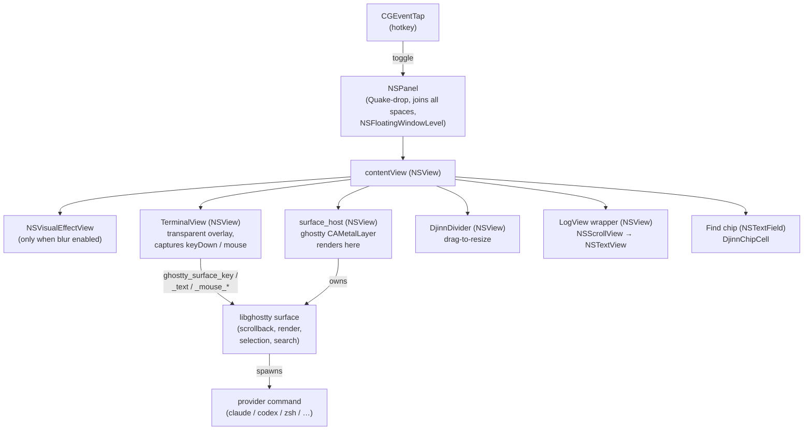
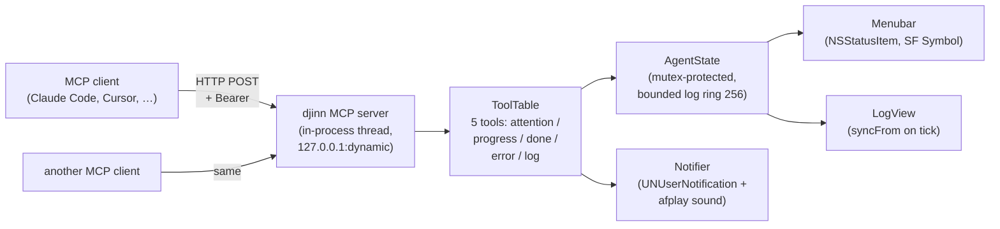
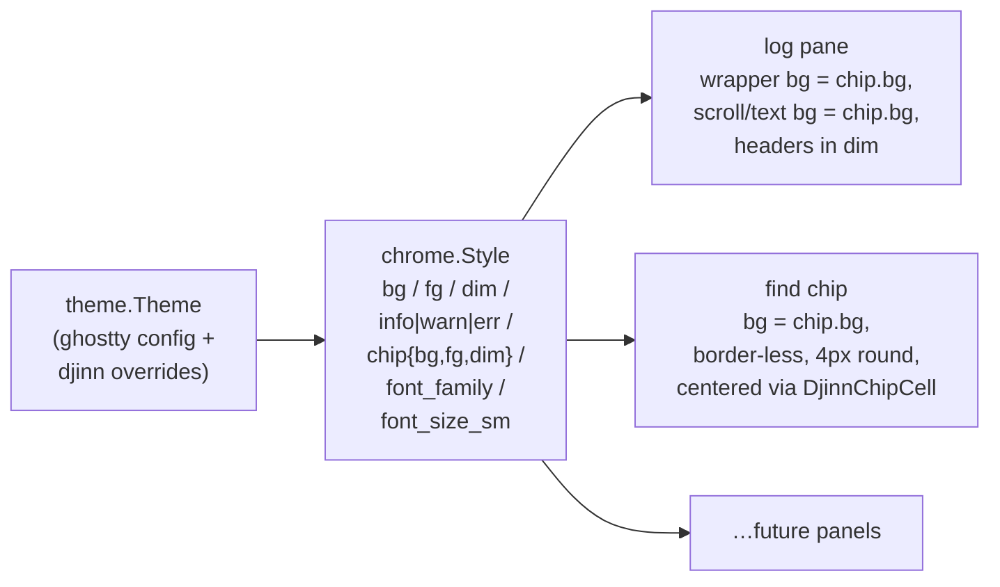

# djinn

Quake-drop terminal for macOS, with an MCP-driven agent status surface.

Two products in one binary:

- A native macOS Quake-drop popup terminal (NSPanel + libghostty-vt + CoreText, with selection, blur, live resize, and a side log).
- An HTTP MCP server that lets AI coding agents push structured status to the menubar — so you know the agent's state without keeping the terminal focused.

## Status

Tier-5 surface migration is complete: djinn is a libghostty-surface
host. ghostty owns the visible terminal area end-to-end (PTY, render,
scrollback, selection, hyperlink hover, search, IME). djinn keeps
panel chrome, MCP server, agent state surface, hotkey, menubar, log
pane, drag-drop, find-overlay UI, and an action keymap.

Working:

- Hotkey-toggled NSPanel (Quake-drop, follows you across spaces, overlays fullscreen).
- libghostty surface bound to a layer-backed NSView; ghostty's CAMetalLayer renders directly.
- Live window resize that reflows the surface + grid.
- NSVisualEffectView blur when ghostty config sets `background-blur-radius`.
- Mouse selection + Cmd+C copy + Cmd+V paste (surface-owned).
- Scrollback (mouse wheel + Cmd+Up/Down).
- Find on page (Cmd+F) — host-owned overlay chip + ghostty's surface search API.
- IME (NSTextInputClient) — preedit + candidate window anchored at the cursor cell.
- Drag-drop file URLs + image data (PNG/TIFF saved to /tmp, paths pasted bracketed).
- Hyperlink hover (OSC 8) with Cmd-click open.
- Menubar SF Symbol icon with a dropdown menu (state, show/hide, copy MCP config, quit).
- HTTP MCP server with bearer-token auth.
- Five-tool MCP surface (attention / progress / done / error / log).
- Side log panel — feed-style entries, group-by-client, drag-to-resize.
- Ghostty config inheritance (font, palette, padding, opacity, blur, theme files with `light:X,dark:Y` switching by system appearance) + live reload.
- User-configurable keymap action table (`keybind = action=trigger`).
- Bell (audible / visual).
- SMAppService login-item registration when launched from the bundle.
- Unified chrome design language (`src/chrome.zig`): log pane + find chip share Style-derived colors + typography.

Known gaps: per-call log expansion (collapsed args + result), animated row insertion, sleep/wake recovery (untested but ghostty's problem now). See `TODO.md`.

## Build

### Prerequisites (one-time)

- **Zig 0.15.2+.** Either install via your package manager (`brew install zig`, mise, asdf, …) or use the included nix flake (see below).
- **Xcode + the optional Metal Toolchain.** djinn links the full libghostty, whose renderer compiles `.metal` shaders:

  ```sh
  sudo xcodebuild -downloadComponent MetalToolchain
  ```

  Several GB; only needs to happen once per Xcode install.

### Build

```sh
./scripts/build.sh                              # debug, zig-out/bin/djinn
./scripts/build.sh test                         # unit tests
./scripts/build.sh -Doptimize=ReleaseFast       # release exe
./scripts/build.sh install-app                  # signed bundle → ~/Applications
```

`scripts/build.sh` wraps `zig build` and handles two integration steps:

1. Applies `patches/ghostty-001-darwin-install.patch` to the cached ghostty source via `scripts/apply-ghostty-patch.sh`. The patch drops an upstream darwin install guard + registers the shared lib in the artifact registry so `dep.artifact("ghostty")` resolves on macOS. Idempotent — re-runs are no-ops.
2. Unsets `DEVELOPER_DIR` + `SDKROOT` and prepends `/usr/bin` to `PATH` so `xcrun` finds the system Metal Toolchain (nix dev shells default these env vars to a stripped Apple SDK that ships no Metal).

If you have `just` installed, the `justfile` exposes the same recipes (`just build`, `just test`, `just install-app`, `just release`, …). Each recipe wraps `nix develop --command bash -c ...` so it works regardless of whether you're inside the dev shell — see "Without a system zig" below.

Debug builds run libghostty's verifyIntegrity sweep and look ~3× slower than they actually are; use ReleaseFast for any performance measurement.

### Without a system zig — use the nix flake

If you don't have zig 0.15.2 on PATH, the flake supplies it:

```sh
nix develop                      # drop into a shell with the right zig
./scripts/build.sh install-app   # then build as normal
```

Or invoke the same step in one shot:

```sh
nix develop --command ./scripts/build.sh install-app
```

The flake also exposes `apps.*` runners that wrap `zig build` for nix-only users (no clone-and-zig dance):

```sh
nix run .                # build + launch the dev exe
nix run .#bundle         # build the signed Djinn.app
nix run .#install        # build + sign + rsync to ~/Applications
nix run .#test           # run the unit suite
nix flake check          # tests in the sandbox
```

**These runners build on the HOST against your working tree**, not inside `/nix/store`. djinn doesn't ship a pure `packages.default`: ghostty's `.metal` shader compile goes through `xcrun → metal`, and Apple ships the Metal Toolchain through cryptexd at `/var/run/com.apple.security.cryptexd/...`, which the nix builder can't reach even with `__noChroot = true`. The dev shell + apps are the right level of nix integration for this codebase.

### Why a wrapper script

`dep.artifact("ghostty")` on darwin is blocked by an unintentional install guard in upstream ghostty (their own comment: "we shouldn't have this guard but we don't currently build on macOS this way ironically so we need to fix that"). PR'ing this fix upstream is on hold until the maintainer understands the xcframework + Xcode build path interaction enough to land the right shape; vendor-patching locally keeps us moving. See `patches/ghostty-001-darwin-install.patch` for the full motivation.

## Install (local demo)

For a real install — Spotlight launchable, login-item capable, surviving relog — build the signed `.app` bundle and copy it to `~/Applications`:

```sh
./scripts/build.sh install-app
open ~/Applications/Djinn.app
```

(or `nix run .#install` if you don't have zig locally — both run the same `bundle-sign` → ad-hoc codesign → rsync chain.)

The bundle lands at `~/Applications/Djinn.app` (no sudo). macOS treats `~/Applications` as a first-class Application directory on macOS 12+, so SMAppService login-items work from there.

The intermediate steps if you want to inspect or move artefacts manually:

```sh
zig build bundle        # zig-out/Djinn.app, unsigned
zig build bundle-sign   # zig-out/Djinn.app + ad-hoc signature
```

### First launch

macOS asks for **Accessibility** permission for the global hotkey (CGEventTap). Without it the app exits. Grant via System Settings → Privacy & Security → Accessibility, then re-launch.

### Login-item

Once the bundle is in `~/Applications`:

```sh
~/Applications/Djinn.app/Contents/MacOS/djinn --login-item-enable
~/Applications/Djinn.app/Contents/MacOS/djinn --login-item-status
```

The CLI flags wrap `SMAppService.mainAppService` and only work from a code-signed bundle home — running the raw `./zig-out/bin/djinn` will return `error.OperationFailed`. Disable with `--login-item-disable` or via `system.open_at_login = false` in the config.

## Wiring an agent

djinn writes its MCP endpoint info on startup to:

```
~/.config/djinn/mcp.json
```

The file already has the correct shape for Claude Code's `.mcp.json` (HTTP transport with bearer token). Three ways to use it:

- Click the menubar icon → **Copy MCP config to clipboard** → paste into your project's `.mcp.json`.
- Symlink it into a project: `ln -sf ~/.config/djinn/mcp.json .mcp.json`.
- Paste manually:

```json
{
  "mcpServers": {
    "djinn": {
      "type": "http",
      "url": "http://127.0.0.1:PORT",
      "headers": { "Authorization": "Bearer TOKEN" }
    }
  }
}
```

The token is regenerated and the port re-bound on each launch — re-paste after each djinn start.

## Tool surface

| Tool              | Purpose                                                      |
|-------------------|--------------------------------------------------------------|
| `djinn_attention` | "I need user input" — flashes the menubar to attention state |
| `djinn_progress`  | "Working on X (3/8)" — menubar text update                   |
| `djinn_done`      | Task complete; menubar returns to a quiescent icon           |
| `djinn_error`     | Task failed                                                  |
| `djinn_log`       | Append a structured event to djinn's side log panel          |

Tools update djinn's internal `AgentState`; the menubar polls at ~4Hz, the log panel at the same cadence.

## UI

| Action               | Binding                              |
|----------------------|--------------------------------------|
| Show / hide          | `ctrl+space` (configurable)          |
| Resize               | Drag any edge or corner              |
| Select text          | Click and drag                       |
| Copy selection       | `cmd+C`                              |
| Special keys         | Arrows, home/end/pgup/pgdn, escape, return, tab, backspace |
| Ctrl + letter        | Sent as C0 control byte (Ctrl+L = 0x0c, etc.)              |
| Alt + key            | ESC-prefixed (xterm convention used by readline / zsh)     |
| Quit                 | `cmd+Q` (from the menubar menu)      |

The menubar dropdown also exposes show/hide, copy MCP config, and quit.

### Picking a hotkey that won't fight macOS

CGEventTap doesn't beat the system-shortcut layer: combos already
claimed by macOS (Spotlight, Mission Control, IME switchers,
text-replacement, …) reach those services before djinn's tap fires.
There is no public API to query the current system-shortcut bindings,
so the practical workaround is to pick a combo macOS doesn't ship
with.

Conflict-free defaults that work on a stock install:

- `ctrl+grave` — backtick key, no system claim by default
- `alt+space` — Spotlight defaults to `cmd+space`, leaving alt+space free
- `ctrl+\\` — backslash, also unclaimed

Conflict-prone combos to avoid:

- `cmd+space` — Spotlight (always)
- `ctrl+space` — Input Source switcher (when multiple sources are enabled)
- `cmd+tab` / `cmd+~` — application + window switcher
- `f3` / `f4` / `f11` / `f12` — Mission Control / Launchpad / Show Desktop / Dashboard on most defaults

If a hotkey silently does nothing after grant, suspect a system claim
first — try a different combo, or reassign the conflicting macOS
shortcut in System Settings → Keyboard → Keyboard Shortcuts.

## Configuration

`~/.config/djinn/config`. Ghostty's `key = value` format — `#` at line
start is a comment, inline `#` is a hex color. All keys optional:

```ini
# Window
window-width = 800
window-height = 400
window-position = top_center
window-toggle-style = instant
window-topmost = true
hide-on-blur = false

# Hotkey (see "Picking a hotkey that won't fight macOS")
hotkey = ctrl+grave

# Provider — child program. Shortcuts: claude / codex / aider /
# gemini / opencode. Anything else falls back to /bin/zsh.
provider = generic
# provider-command = /opt/bin/my-claude

# Theme — falls through to ghostty's resolved config when
# inherit-ghostty=true (default). Overrides only listed below.
inherit-ghostty = true
# opacity = 0.95
# background = #1a1a1e
# foreground = #cccccc
# cursor-color = #ffffff

# Terminal typography
# font-family = Menlo
# font-size = 13
# padding-x = 8
# padding-y = 8

# Log pane
log-pane-enabled = false
log-pane-width-fraction = 0.28
log-pane-width-min = 220
log-pane-width-max = 360

# Bell
bell-audible = true
bell-visual = false
bell-sound = Tink

# System
open-at-login = false
mcp-enabled = true
system-notifications = true
menubar-icon = true
attention-sound = Glass
scrollback-size = 10000

# Keymap overrides — `keybind = <action>=<trigger>`
# keybind = clear_scrollback=cmd+l
# keybind = copy=cmd+c
```

`provider` selects the default command to spawn in the terminal. Known shortcuts: `claude`, `codex`, `aider`, `gemini`, `opencode`. Anything else uses `/bin/zsh` (macOS's default since 10.15). Override with `--provider <name>` or by setting `provider-command` directly.

> **Why /bin/zsh and not $SHELL?** djinn is normally launched from a dev shell (`nix develop`, devbox, etc.) which sets `$SHELL` to a sandboxed bash with broken terminfo lookup. `/bin/zsh` always has working terminfo so readline arrow keys / Ctrl bindings work without surprises.

### Ghostty config inheritance

By default, djinn reads `~/.config/ghostty/config` and applies the same font, palette, padding, opacity, and blur. Theme files are searched in:

- `~/.config/ghostty/themes`
- `~/Library/Application Support/com.mitchellh.ghostty/themes`
- `/Applications/Ghostty.app/Contents/Resources/ghostty/themes`
- `/opt/homebrew/share/ghostty/themes`
- `/usr/local/share/ghostty/themes`

The `theme = light:Day,dark:Night` syntax is honored — djinn picks the variant matching the macOS system appearance at startup (queried via `NSAppearance`). Set `inherit-ghostty = false` to opt out and use built-in defaults.

Any `font-*` / `padding-*` / `opacity` / `background` / `foreground` / `cursor-color` set in djinn's config overrides ghostty's value.

### Font sharpness vs blur

If text reads softer in djinn than in ghostty on the same font, the cause is almost certainly `background-opacity < 1`. macOS's `CGContextSetShouldSmoothFonts` silently no-ops on non-opaque destinations — the toggle that gives terminal.app / ghostty their crisp stems is bypassed when the panel is translucent.

Workaround:

```ini
opacity = 1.0
```

Set in `~/.config/djinn/config` to override ghostty's `background-opacity`. Blur stays via `background-blur-radius`, but the visual-effect view sits behind an opaque terminal bg so font smoothing kicks in. Trade-off: you no longer see the blurred backdrop through cell bg cells (only the panel chrome around the text).

## Architecture

Post-Tier-5: ghostty owns the visible terminal area end-to-end (PTY,
render, scrollback, selection, hyperlink hover, search). djinn keeps
panel chrome, MCP server, agent state surface, hotkey, menubar, log
pane, drag-drop, find-overlay UI, and an action keymap.

### View tree



### Agent surface



### Chrome (Style.fromTheme)

`src/chrome.zig` derives one chrome surface for every host UI element
from the resolved Theme. Log pane + find chip both consume it; future
panels (settings, palette) plug in via `applyStyle(style)`.



## Acknowledgements

djinn stands almost entirely on top of work that other people did:

- **[ghostty](https://github.com/ghostty-org/ghostty)** (Mitchell
  Hashimoto + ghostty contributors) — the visible terminal area is
  ghostty's `libghostty` surface, end-to-end. djinn's config grammar
  (`key = value`, `keybind = action=trigger`, `theme = light:X,dark:Y`)
  is also lifted from ghostty so users with an existing ghostty
  config drop straight in. MIT-licensed.
- **[zig-objc](https://github.com/mitchellh/zig-objc)** (Mitchell
  Hashimoto) — the `objc.msgSend` primitives every host-side Cocoa
  call goes through. MIT-licensed.
- **Apple** — SF Symbols (menubar state glyphs) and the macOS SDK
  frameworks (AppKit, Metal, CoreText, …).
- **[Anthropic](https://modelcontextprotocol.io)** — Model Context
  Protocol spec.
- **The Quake-drop terminal lineage** — Quake's tilde console →
  Tilda → Yakuake → Visor → iTerm2's hotkey window → ghostty's
  `quick-terminal`. djinn is one more entry in that line.

See [`NOTICES.md`](NOTICES.md) for full third-party attribution
including the libraries ghostty itself pulls in (libxev, vaxis,
simdutf, harfbuzz, freetype, …) — they ride along inside the
redistributed `libghostty.dylib`.

## License

MIT — see [`LICENSE`](LICENSE).
